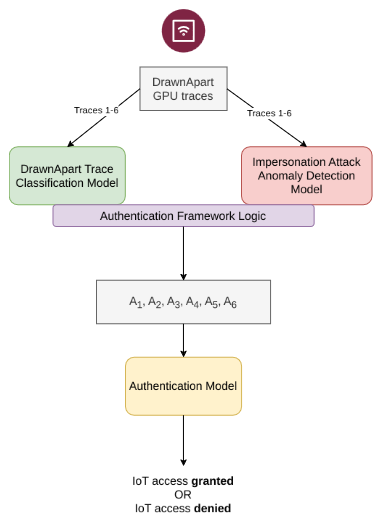
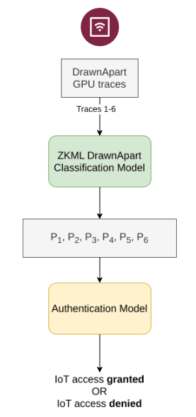

# IoT-GPU-ID
PUFs (Physical unclonable function) represent a unique approach to enhancing security measures in devices such as microprocessors by using naturally occurring unique physical variations during manufacturing processes. These functions operate by generating a distinct "digital fingerprint" output, serving as an unreplicable identifier for each device when presented with specific input conditions. However, if a device hasn’t been fitted with a PUF during semiconductor manufacturing, then these IoT devices are unable to take advantage of these security features. In this chapter, we propose a hardware level authentication framework for IoT devices, which is able to distinguish between devices of the exact same make and model. This is possible by using a fingerprinting methodology from the browser that is capable of uniquely identifying on device GPUs. As devices are sharing digital fingerprints of their GPU to confirm their identity, a patient adversary could harvest enough of these GPU fingerprints to start an impersonation attack. To further enhance the security and privacy of the authentication model, we propose two approaches: 

1. training with additional synthetic data that simulates an impersonation attack, further hardening the model and 
2. Using ZKML to hide the inputs to the model, with the ability to make the outputs public, rendering the impersonation attack ineffective. 

Our framework is able to achieve 99% accuracy across a range of IoT devices, some being the exact same make and model. Our framework allows any SBC IoT device with a GPU supporting WebGL to take advantage of the physical characteristics of devices for security, without the need for a PUF to be integrated during a device’s manufacturing process.

## Zero-Knowledge Machine Learning Extension
To avoid sending the GPU trace over the network, and to completely mitigate machine learning based attacks (specifically, attacks involving maliciously generated synthetic data), we propose an alternative implementation. Using a zero knowledge machine learning framework such as EZKL [167].
EZKL is useful in three key scenarios to enable verifiable, privacy-preserving computations without exposing sensitive data or models:
1. Public Model, Private Data: A researcher can prove their model’s accuracy on sensitive private data (e.g., medical records) without sharing the data. This allows third parties to verify results without accessing confidential information.
2. Private Model, Public Data: A company (e.g., a hedge fund) can prove their proprietary model performs as claimed using public benchmark data. This assures stakeholders of the model’s efficacy without revealing its internals.
3. Public Model, Public Data: On resource-constrained systems (e.g., blockchains), a user can execute a public model off-chain (e.g., rebalancing a portfolio using public market data) and generate a proof of correct execution. This proof triggers automated, trusted on-chain actions while avoiding costly on-chain computations.

# Project Architecture
For this project we created a tiered architecture rather than a monolith, each section has clear responsibilities and is easy to reason about. Along with reasoning clarity there's a range of benefits: 
1. Models are smaller in size with simple internal architecture
2. Test/train loops are quick. No need to re-train single large model
3. Performance profiling becomes simple, as each models performance can be queried in isolation

The project uses three models: the Classification Model, the Anomaly Detection Model, and the Authentication Model. 
The classification model is responsible for taking drawn apart traces (essentially timing artifacts of an IoT device doing some work with WebGL) and attempting to identify a device. 
The Anomaly Detection Model tries to figure out if a malicious actor is attempting to impersonate a genuine device. We modeled a threat actor who harvests GPU fingerprints via a MitM attack. The actor uses simple noise, linear transformations via distributions (norm, gamma, gaussian etc), and ML based methods (GAN/VAE) to try and impersonate the device by creating forged fingerprints. This models a threat actor with varying capabilities. 
Finally the Authentication model is a distilled model, trained from the outputs of the Classification and Anomaly Detection Models. This distilled takes a nuanced approach to differentiating between malicious and genuine authentication attempts. Each model requires 6 unique GPU traces to become authenticated. This student model has captured the authentication behaviour of a genuine device, and the behaviour of a malicious device, without having to worry about either classification or anomaly detection. The Authentication model understands the pattern of a good device, vs a bad device.

# Repo Structure
1. IoT Classification Folder - contains the initial notebook file to create the classification model via GPU fingerprints harvested from physical IoT devices. A number of different methods where tested with varying compatibility problems and poor classification performance. We landed on using the onscreen method which supported all devices and had acceptable classification accuracy.
2. Impersonation Detection Folder - These notebooks train the various tiers of threat actors. First we give these simulated threat actors access to device fingerprints, and we let them build forged fingerprints. The actors add noise, apply linear transformations, and train their own ML models to created forged fingerprints. We capture the forged fingerprints from the threat actors, and train a model to tell the difference between the forged and genuine fingerprints - the Anomaly Detection Model.
3. Authentication Folder - Takes the outputs of the Classification and Anomaly Detection Models and trains the distilled Authentication Model. Models the behaviours of good vs bad devices
4. ZKML Folder - Creates a Zero-Knowledge Machine Learning alternative to our classification model as a PoC. The advantage here is that models can send cryptographically signed proof that their fingerprint is genuine, rather than having to send the underlying raw fingerprints. The trained model was tested on 8GB Raspberry Pis and Odroids.
5. ZKML Classification Folder - A PoC of the ZKML method (requiring only the classification model). If we assume fingerprints aren't shared in the ZKML version of the architecture, we can remove the Anomaly Detection and Authentication Models. Threat model here has changed, assume here raw fingerprints can't be leaked to an adversary. A picture of this revised architecture is shown below.

